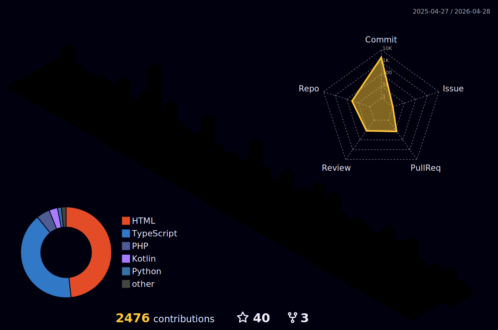

# Hi there! 👋 I'm M Mohan Reddy

---

### 👨‍💻 About Me

- 🔭 Currently working on **innovative web development projects**
- 🌱 Learning **Python, JavaScript, and modern web technologies**
- 👯 Open to collaborate on **Microsoft technologies and open-source projects**
- 💬 Ask me about **coding best practices and web development**
- 📫 Reach me at **madhiremohanreddy@gmail.com**
- ⚡ Fun fact: **I'm an introvert who loves exploring new tech! 😅**

 

---

### 🌟 Daily Motivation

---

## 🤝 Connect With Me

---

## 💻 Tech Stack & Skills

### Frontend Development

### Backend & Languages

### Databases & Tools

### Design & Others

---

## 📊 GitHub Statistics

### 📈 Contribution Graph

### 📊 Detailed Stats

---

## 🏆 LeetCode Performance

---

## 🎨 3D Contribution Profile

---

### 💡 *"Code is like humor. When you have to explain it, it's bad."* 

**Thank you for visiting my profile! Feel free to reach out for collaborations or just a tech chat! 🚀**

