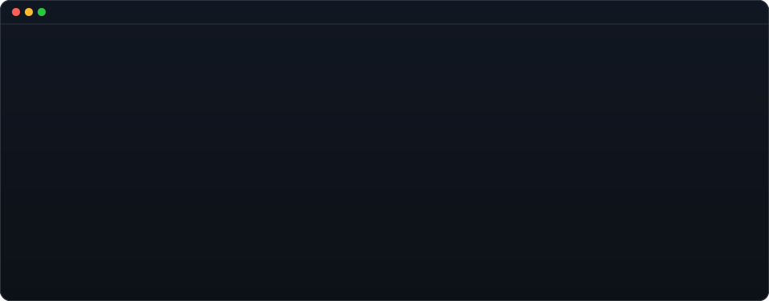
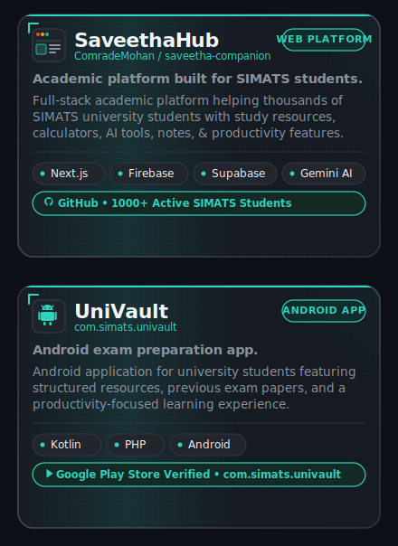
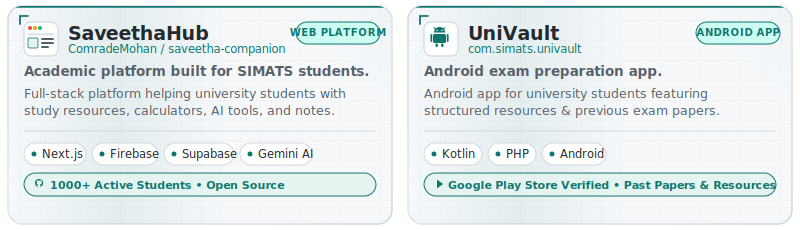

<picture>
  <source media="(prefers-color-scheme: dark)" srcset="./profile-combined.svg">
  <source media="(prefers-color-scheme: light)" srcset="./profile-combined-light.svg">
  
</picture>

<!-- <picture>
    <source media="(max-width:768px)" srcset="./profile-combined-light.svg">
    <source media="(min-width:769px)" srcset="./profile-combined.svg">
    
</picture> -->

# 👋 Hi, I'm M Mohan Reddy

<picture>
  <source
    media="(prefers-color-scheme: dark)"
    srcset="https://komarev.com/ghpvc/?username=COMRADEMOHAN&label=Profile+Views&style=for-the-badge&color=10B981">

  <source
    media="(prefers-color-scheme: light)"
    srcset="https://komarev.com/ghpvc/?username=COMRADEMOHAN&label=Profile+Views&style=for-the-badge&color=059669">

  
</picture>

<!-- Signature status strip — custom SVG asset, save alongside README as ./assets/status-bar.svg -->
<picture>
  <source media="(prefers-color-scheme: dark)" srcset="./assets/status-bar.svg">
  <source media="(prefers-color-scheme: light)" srcset="./assets/status-bar-light.svg">
  
</picture>

<a href="https://mohanreddy.me">
<picture>
  <source media="(prefers-color-scheme: dark)" srcset="https://img.shields.io/badge/Portfolio-0F172A?style=for-the-badge&logo=firefox&logoColor=2DD4BF">
  <source media="(prefers-color-scheme: light)" srcset="https://img.shields.io/badge/Portfolio-F8FAFC?style=for-the-badge&logo=firefox&logoColor=0F172A&labelColor=F8FAFC&color=F8FAFC">
  
</picture>
</a>

<a href="mailto:madhiremohanreddy@gmail.com">
<picture>
  <source media="(prefers-color-scheme: dark)" srcset="https://img.shields.io/badge/Email-0F172A?style=for-the-badge&logo=gmail&logoColor=2DD4BF">
  <source media="(prefers-color-scheme: light)" srcset="https://img.shields.io/badge/Email-F8FAFC?style=for-the-badge&logo=gmail&logoColor=0F172A&labelColor=F8FAFC&color=F8FAFC">
  
</picture>
</a>

<a href="https://www.linkedin.com/in/mmohanreddy">
<picture>
  <source media="(prefers-color-scheme: dark)" srcset="https://img.shields.io/badge/Resume-0F172A?style=for-the-badge&logo=readdotcv&logoColor=2DD4BF">
  <source media="(prefers-color-scheme: light)" srcset="https://img.shields.io/badge/Resume-F8FAFC?style=for-the-badge&logo=readdotcv&logoColor=0F172A&labelColor=F8FAFC&color=F8FAFC">
  
</picture>
</a>

<!-- ↑ Point the Resume badge at a direct PDF link or your interactive resume page once hosted -->

---

## 💫 About Me

- 🎓 Final-year B.E. Computer Science student at SIMATS University, graduating 2026 (CGPA ~8.65)
- 💻 Full-stack developer — shipped **SaveethaHub** and **UniVault** to real users
- ☕ Oracle Certified Professional: Java SE 17 Developer
- 🚀 Focused on software engineering, system design & product-led development
- 🌱 Currently sharpening: `Java` · `Spring Boot` · `React` · `System Design` · `Cloud Computing`
- 💬 Ask me about: `Java` · `React` · `Node.js` · `Firebase` · `Web Development`

> ⚡ I enjoy building useful software and solving real-world problems.

---

## 🚀 Featured Projects

<picture>
  <!-- Mobile -->
  <source
    media="(max-width:768px)"
    srcset="./assets/featured-projects-mobile-dark.svg">

  <!-- Laptop/Desktop -->
  <source
    media="(min-width:769px)"
    srcset="./assets/featured-projects-dark.svg">

  <!-- Fallback -->
  
</picture>

---

## 🌐 Connect With Me

---

## 💻 Tech Stack

<picture>
  <source
    media="(prefers-color-scheme: dark)"
    srcset="https://skillicons.dev/icons?i=java,python,cpp,kotlin,php,js,ts,react,nextjs,tailwind,bootstrap&theme=dark">

  <source
    media="(prefers-color-scheme: light)"
    srcset="https://skillicons.dev/icons?i=java,python,cpp,kotlin,php,js,ts,react,nextjs,tailwind,bootstrap&theme=light">

  
</picture>

 

<picture>
  <source
    media="(prefers-color-scheme: dark)"
    srcset="https://skillicons.dev/icons?i=html,css,nodejs,express,firebase,supabase,mongodb,mysql,git,github,docker,linux,vscode,figma,postman&theme=dark">

  <source
    media="(prefers-color-scheme: light)"
    srcset="https://skillicons.dev/icons?i=html,css,nodejs,express,firebase,supabase,mongodb,mysql,git,github,docker,linux,vscode,figma,postman&theme=light">

  
</picture>

---

## 📊 Developer Dashboard

<table align="center" border="0" cellspacing="0" cellpadding="0">
<tr>
<td align="center" width="50%">

<picture>
  <source media="(prefers-color-scheme: dark)" srcset="https://leetcard.jacoblin.cool/comrademohan?theme=dark">
  <source media="(prefers-color-scheme: light)" srcset="https://leetcard.jacoblin.cool/comrademohan?theme=light">
  
</picture>

</td>

<td align="center" width="50%">

</td>
</tr>
</table>
 

<table width="92%">
<tr>
<td width="65%" align="center">
<picture>
  <source media="(prefers-color-scheme: dark)" srcset="https://github-profile-summary-cards.vercel.app/api/cards/profile-details?username=comrademohan&theme=github_dark&animation=sequence">
  <source media="(prefers-color-scheme: light)" srcset="https://github-profile-summary-cards.vercel.app/api/cards/profile-details?username=comrademohan&theme=github&animation=sequence">
  
</picture>
</td>
<td width="35%" align="center">
<picture>
  <source media="(prefers-color-scheme: dark)" srcset="https://github-profile-summary-cards.vercel.app/api/cards/productive-time?username=comrademohan&theme=github_dark&animation=sequence&utcOffset=0">
  <source media="(prefers-color-scheme: light)" srcset="https://github-profile-summary-cards.vercel.app/api/cards/productive-time?username=comrademohan&theme=github&animation=sequence&utcOffset=0">
  
</picture>
</td>
</tr>
</table>

 

<!-- <picture>
  <source media="(prefers-color-scheme: dark)" srcset="https://leetcard.jacoblin.cool/comrademohan?theme=dark">
  <source media4="(prefers-color-scheme: light)" srcset="https://leetcard.jacoblin.cool/comrademohan?theme=light">
  
</picture> -->

 

---

## 🎨 3D Contribution Graph

<picture>
  <source media="(prefers-color-scheme: dark)" srcset="./profile-3d-contrib/profile-night-rainbow.svg">
  <source media="(prefers-color-scheme: light)" srcset="./profile-3d-contrib/profile-season-animate.svg">
  
</picture>

---

## ⭐ Thanks for Visiting!

> *"Programs must be written for people to read, and only incidentally for machines to execute."*

📬 **Open to SDE Internship & New-Grad Roles** — [Email](mailto:madhiremohanreddy@gmail.com) · [Portfolio](https://mohanreddy.me) · [LinkedIn](https://www.linkedin.com/in/mmohanreddy)

