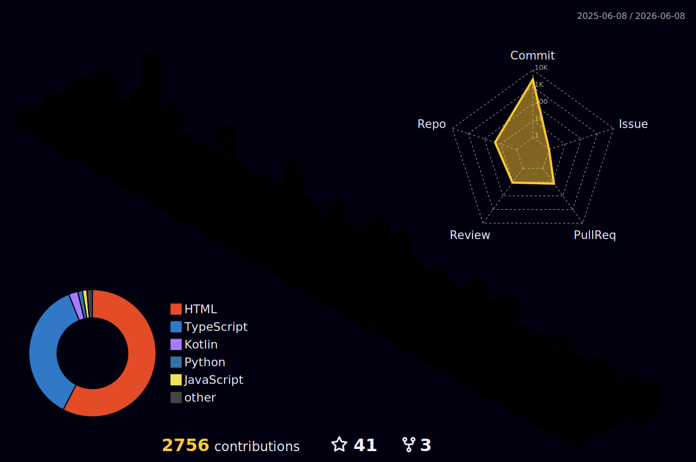

<div align="center">

# 👋 Hi, I'm M Mohan Reddy


<br>


</div>

---


# 💫 About Me

🎓 Final Year Computer Science Engineering Student

💻 Passionate about Full Stack Development

🚀 Interested in Software Engineering & Open Source

🌱 Currently Learning

- Java
- Spring Boot
- React
- System Design
- Cloud Computing

💬 Ask Me About

- Java
- React
- Node.js
- Firebase
- Web Development

📫 **Email**

```text
madhiremohanreddy@gmail.com
```

⚡ Fun Fact

> I enjoy building useful software and solving real-world problems.

<br clear="right"/>

---

# 🌐 Connect With Me

<div align="center">

<a href="https://www.linkedin.com/in/mmohanreddy">

</a>

<a href="https://leetcode.com/u/comrademohan/">

</a>

<a href="https://kaggle.com/mohanreddy007">

</a>

<a href="https://www.instagram.com/comrade_mohan666/">

</a>

</div>

---

# 💻 Tech Stack

<div align="center">

### Languages


<br>

### Frontend


<br>

### Backend


<br>

### Tools


</div>

---

# 📊 GitHub Statistics

<div align="center">


</div>

---

# 💻 LeetCode

<div align="center">


</div>

---

# 📈 Contribution Graph

<div align="center">


</div>

---

# ⚡ Coding Activity

<div align="center">


</div>

---

# 🎨 3D Contribution Graph

<div align="center">



</div>

---

<div align="center">

## ⭐ Thanks for Visiting!

> *"Programs must be written for people to read, and only incidentally for machines to execute."*

<br>


</div>
