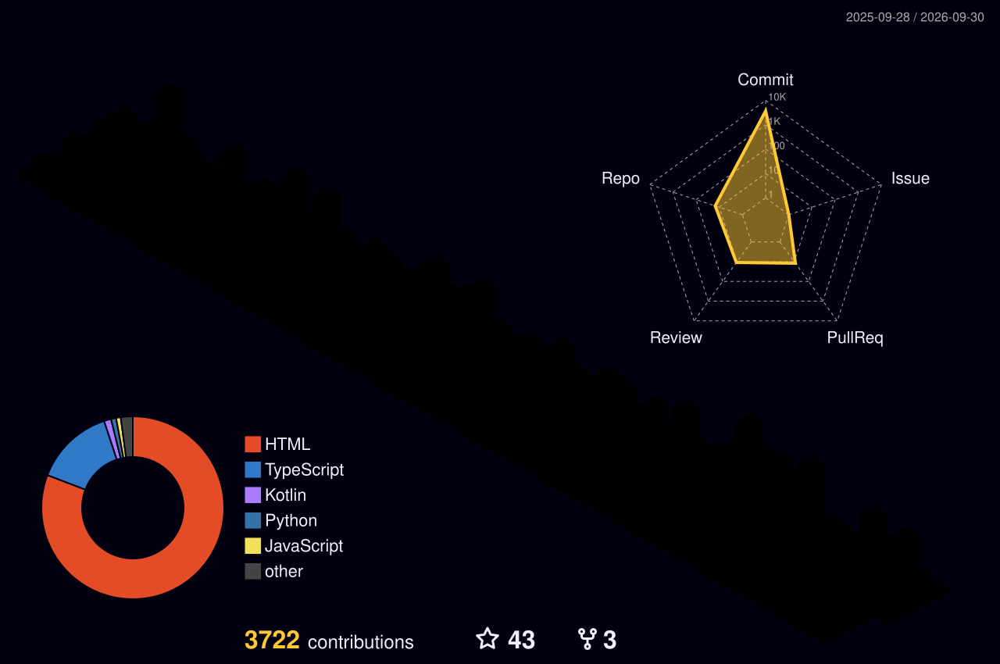

<!-- SEO Meta: M Mohan Reddy, ComradeMohan, Software Development Engineer, SDE, Software Engineer, Java SE 17 Certified, Spring Boot, React, Next.js, SaveethaHub, UniVault, SIMATS University, LeetCode, Systems Engineer, Cloud & APIs -->

<a href="https://mohanreddy.is-a-good.dev/#about" target="_blank" rel="noopener noreferrer">
<picture>
  
</picture>
</a>

# 👋 Hi, I'm M Mohan Reddy

<picture>
  <source
    media="(prefers-color-scheme: dark)"
    srcset="https://komarev.com/ghpvc/?username=COMRADEMOHAN&label=Profile+Views&style=for-the-badge&color=10B981">

  <source
    media="(prefers-color-scheme: light)"
    srcset="https://komarev.com/ghpvc/?username=COMRADEMOHAN&label=Profile+Views&style=for-the-badge&color=059669">

  
</picture>

<!-- Signature status strip — custom SVG asset (auto dark/light adaptive) -->
<picture>
  
</picture>

<a href="https://mohanreddy.is-a-good.dev/" target="_blank" rel="noopener noreferrer">
<picture>
  <source media="(prefers-color-scheme: dark)" srcset="https://img.shields.io/badge/Portfolio-0F172A?style=for-the-badge&logo=firefox&logoColor=2DD4BF">
  <source media="(prefers-color-scheme: light)" srcset="https://img.shields.io/badge/Portfolio-F8FAFC?style=for-the-badge&logo=firefox&logoColor=0F172A&labelColor=F8FAFC&color=F8FAFC">
  
</picture>
</a>
&nbsp;
<a href="mailto:madhiremohanreddy@gmail.com">
<picture>
  <source media="(prefers-color-scheme: dark)" srcset="https://img.shields.io/badge/Email-0F172A?style=for-the-badge&logo=gmail&logoColor=2DD4BF">
  <source media="(prefers-color-scheme: light)" srcset="https://img.shields.io/badge/Email-F8FAFC?style=for-the-badge&logo=gmail&logoColor=0F172A&labelColor=F8FAFC&color=F8FAFC">
  
</picture>
</a>
&nbsp;
<a href="https://mohanreddy.is-a-good.dev/Mohan-Reddy-Resume.pdf" target="_blank" rel="noopener noreferrer">
<picture>
  <source media="(prefers-color-scheme: dark)" srcset="https://img.shields.io/badge/Resume-0F172A?style=for-the-badge&logo=readdotcv&logoColor=2DD4BF">
  <source media="(prefers-color-scheme: light)" srcset="https://img.shields.io/badge/Resume-F8FAFC?style=for-the-badge&logo=readdotcv&logoColor=0F172A&labelColor=F8FAFC&color=F8FAFC">
  
</picture>
</a>

---

## 💫 About Me

- 🎓 **Education**: Final-year B.E. Computer Science student at **SIMATS University**, graduating in 2026 (CGPA ~8.65)
- 💻 **Software & Systems Engineer**: Designed, built, and shipped **SaveethaHub** (Academic Platform) & **UniVault** (Android Exam Prep) to active users
- ☕ **Certification**: **Oracle Certified Professional: Java SE 17 Developer**
- 🚀 **Core Focus**: Software Engineering, Distributed Systems, System Design & Product Architecture
- 🌱 **Currently Sharpening**: `Java` · `Spring Boot` · `System Design` · `Cloud Computing` · `React` · `Next.js`
- 💬 **Ask Me About**: `Java Backend` · `Microservices` · `Node.js` · `Firebase` · `RESTful APIs` · `System Architecture`

> ⚡ *"I enjoy building resilient backend systems, scalable cloud services, and solving real-world engineering challenges."*

---

## 🚀 Featured Projects

<a href="https://mohanreddy.is-a-good.dev/#projects" target="_blank" rel="noopener noreferrer">
  <picture>
    <source media="(max-width:768px)" srcset="./assets/featured-project-mobile.svg">
    <source media="(min-width:769px)" srcset="./assets/featured-project-laptop.svg">
    
  </picture>
</a>

---

## 🌐 Connect With Me

&nbsp;&nbsp;
&nbsp;&nbsp;
&nbsp;&nbsp;
&nbsp;&nbsp;

---

## 💻 Tech Stack & Core Competencies

<strong>Languages & Core Frameworks</strong>

<picture>
  <source
    media="(prefers-color-scheme: dark)"
    srcset="https://skillicons.dev/icons?i=java,python,cpp,kotlin,php,js,ts,react,nextjs,tailwind,bootstrap&perline=8&theme=dark">

  <source
    media="(prefers-color-scheme: light)"
    srcset="https://skillicons.dev/icons?i=java,python,cpp,kotlin,php,js,ts,react,nextjs,tailwind,bootstrap&perline=8&theme=light">

  
</picture>

<strong>Backend, Databases & Cloud Tools</strong>

<picture>
  <source
    media="(prefers-color-scheme: dark)"
    srcset="https://skillicons.dev/icons?i=html,css,nodejs,express,firebase,supabase,mongodb,mysql,git,github,docker,linux,vscode,figma,postman&perline=8&theme=dark">

  <source
    media="(prefers-color-scheme: light)"
    srcset="https://skillicons.dev/icons?i=html,css,nodejs,express,firebase,supabase,mongodb,mysql,git,github,docker,linux,vscode,figma,postman&perline=8&theme=light">

  
</picture>

---

## 📊 Developer Dashboard & Coding Metrics

<table align="center" border="0" cellspacing="0" cellpadding="0">
<tr>
<td align="center" width="50%">

<a href="https://leetcode.com/u/Comrademohan" target="_blank" rel="noopener noreferrer">
<picture>
  <source media="(prefers-color-scheme: dark)" srcset="https://leetcard.jacoblin.cool/comrademohan?theme=dark">
  <source media="(prefers-color-scheme: light)" srcset="https://leetcard.jacoblin.cool/comrademohan?theme=light">
  
</picture>
</a>

</td>

<td align="center" width="50%">

</td>
</tr>
</table>
 

<table width="92%" align="center" border="0" cellspacing="0" cellpadding="0">
<tr>
<td width="65%" align="center">
<picture>
  <source media="(prefers-color-scheme: dark)" srcset="https://github-profile-summary-cards.vercel.app/api/cards/profile-details?username=comrademohan&theme=github_dark&animation=sequence">
  <source media="(prefers-color-scheme: light)" srcset="https://github-profile-summary-cards.vercel.app/api/cards/profile-details?username=comrademohan&theme=github&animation=sequence">
  
</picture>
</td>
<td width="35%" align="center">
<picture>
  <source media="(prefers-color-scheme: dark)" srcset="https://github-profile-summary-cards.vercel.app/api/cards/productive-time?username=comrademohan&theme=github_dark&animation=sequence&utcOffset=0">
  <source media="(prefers-color-scheme: light)" srcset="https://github-profile-summary-cards.vercel.app/api/cards/productive-time?username=comrademohan&theme=github&animation=sequence&utcOffset=0">
  
</picture>
</td>
</tr>
</table>

 

<!--  -->

---

## 🎨 3D GitHub Contribution Visualizer

<picture>
  <source media="(prefers-color-scheme: dark)" srcset="./profile-3d-contrib/profile-night-rainbow.svg">
  <source media="(prefers-color-scheme: light)" srcset="./profile-3d-contrib/profile-season-animate.svg">
  
</picture>

---

<a href="https://mohanreddy.is-a-good.dev/" target="_blank" rel="noopener noreferrer">
<picture>
    <source media="(max-width:768px)" srcset="./assets/thank-you-mobile.svg">
    <source media="(min-width:769px)" srcset="./assets/thank-you-laptop.svg">
    
</picture>
</a>

