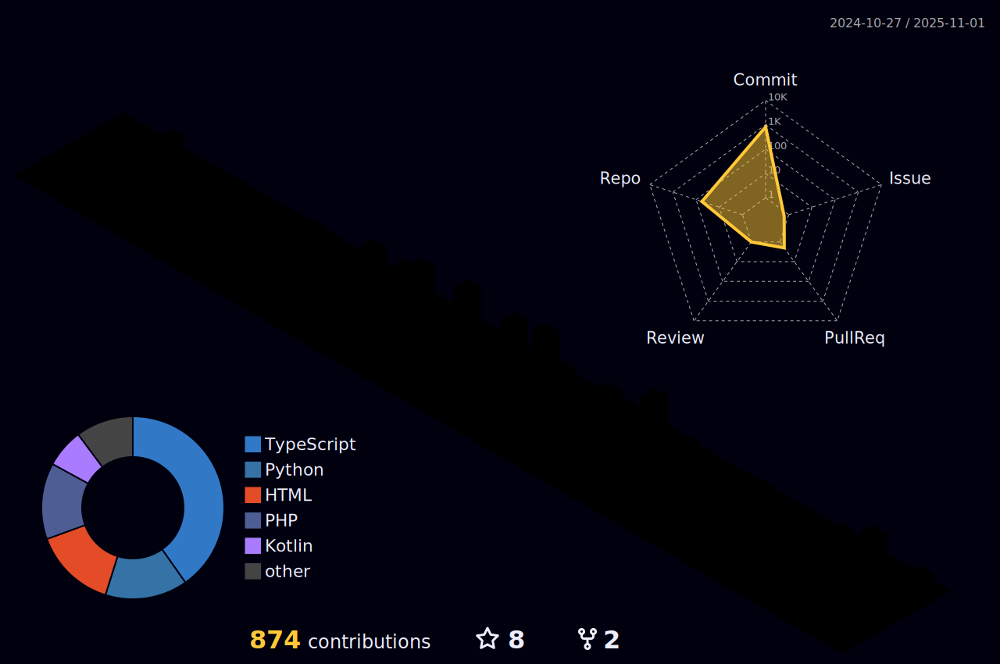

  <h1 align="center">Hi  I'm M Mohan Reddy</h1>

  

  

## 📋 Table of Contents

- [About Me](#-about-me)
- [Connect with Me](#-connect-with-me)
- [My Skill Set](#-my-skill-set)
- [GitHub Stats](#-github-stats)

---

## 👨‍💻 About Me

- 🔭 I'm currently working on **web development projects**
- 🌱 I'm currently learning **Python, HTML, CSS, JavaScript**
- 👯 I'm looking to collaborate on **Microsoft technologies and projects**
- 💬 Ask me about **coding best practices**
- 📫 How to reach me: **madhiremohanreddy@gmail.com**
- ⚡ Fun fact: **I am an introvert who loves exploring new technologies! 😅**

---

  

  

---

## 🤝 Connect with Me

  
  
  
  

---

## 🛠 My Skill Set

  
  
  
  
  
  
  
  
  
  
  
  
  
  
  
  
  
  
  
  
  

---

## 📊 GitHub Stats

  

  

  

---

  

